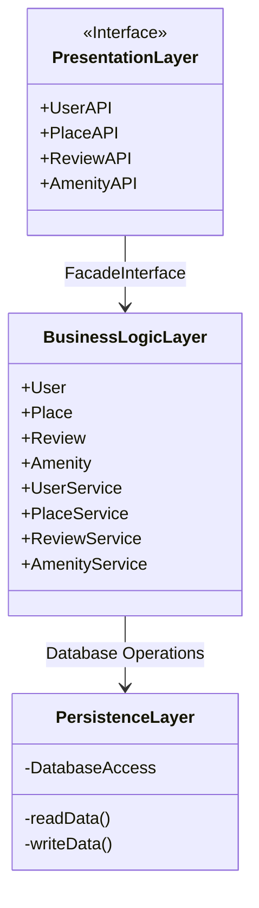
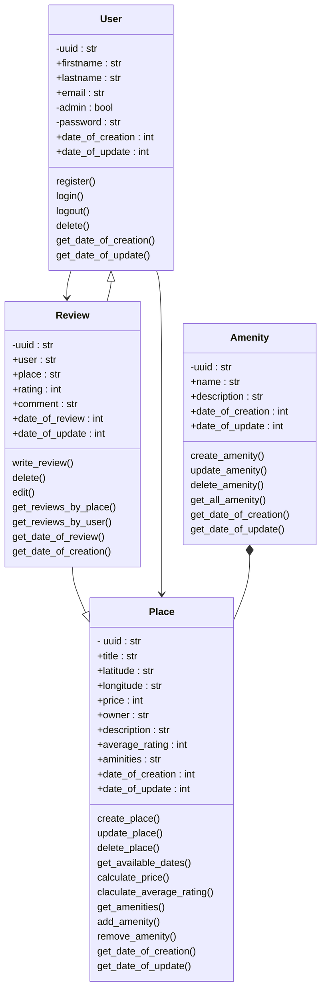
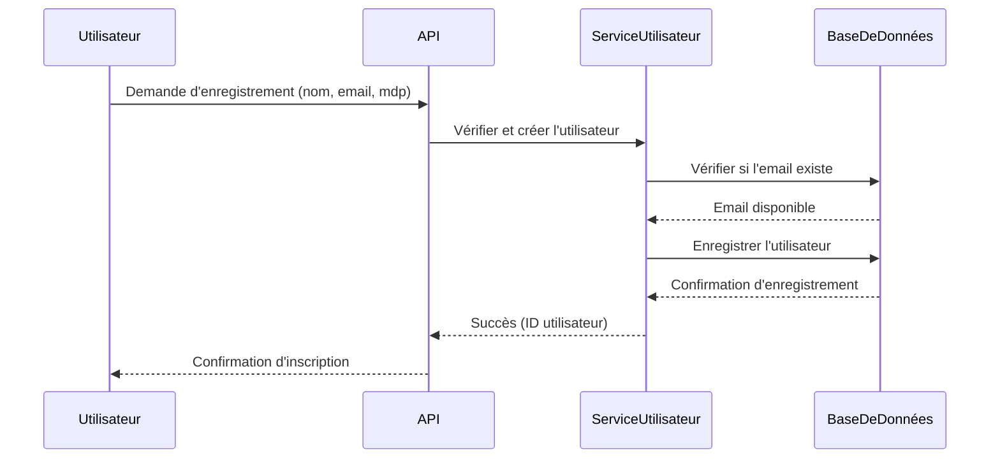
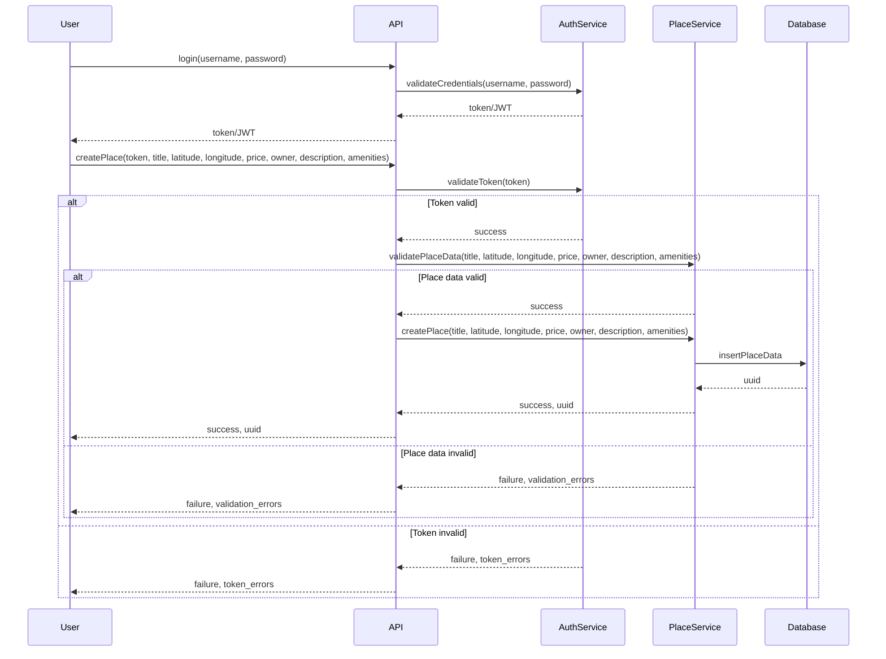
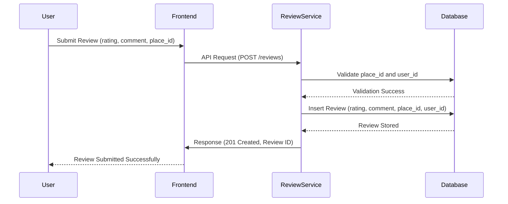

# **HBnB Technical Documentation**

## **1. Introduction**

### **Purpose of the Document**

This document provides a comprehensive technical overview of the HBnB project, detailing its architecture, business logic, and API interactions. It serves as a reference for developers and stakeholders to understand the system design and facilitate its implementation.

### **Scope**

The HBnB project is a platform where users can register, log in, create places, write reviews, and search for accommodations based on filters. This document covers:

- The **high-level architecture** of the application.
- The **detailed class diagram** for the Business Logic Layer.
- The **sequence diagrams** illustrating key API interactions.

---

## **2. High-Level Architecture**

### **Layered Architecture Overview**

The system follows a three-layer architecture:

1. **Presentation Layer** (Frontend): Handles user interactions and API requests.
2. **Business Logic Layer** (Backend Services): Processes data and enforces business rules.
3. **Persistence Layer** (Database): Stores and retrieves application data.

### **High-Level Package Diagram**

**Explanation:**

- The **Presentation Layer** interacts with users through APIs.
- The **Business Logic Layer** processes and validates data before interacting with the database.
- The **Persistence Layer** manages data storage and retrieval operations.

---

## **3. Business Logic Layer**

### **Class Diagram for Core Entities**

**Explanation:**

- **User** class manages authentication and profile details.
- **Review** class links a user to a place with ratings and comments.
- **Place** represents an accommodation, containing details and amenities.
- **Amenity** defines additional features available at a place.

---

## **4. API Interaction Flow**

### **User Registration Sequence**

### **User Login and Place Creation**

### **Review Submission**

---

## **5. Conclusion**

This document outlines the key architectural components, business logic, and API workflows of the HBnB platform. It serves as a foundational reference for the development team to ensure a well-structured and efficient implementation.

