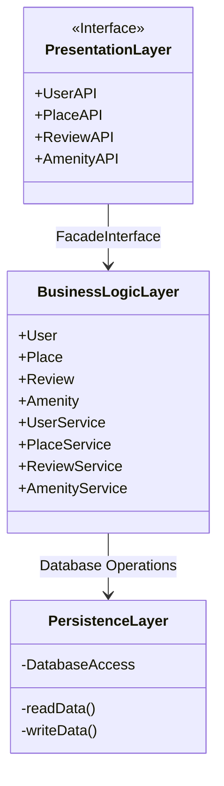
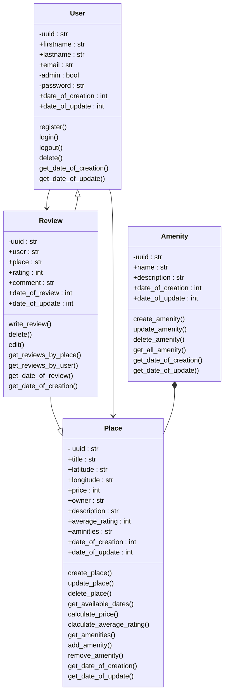
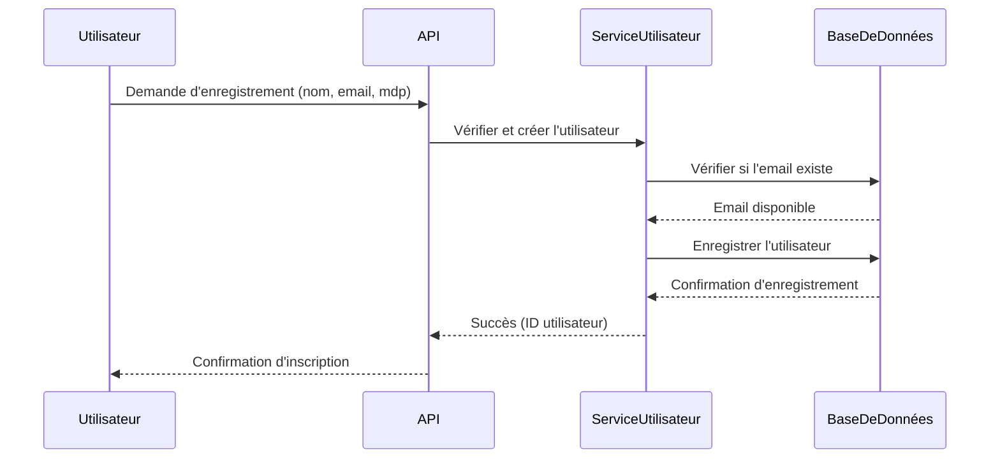
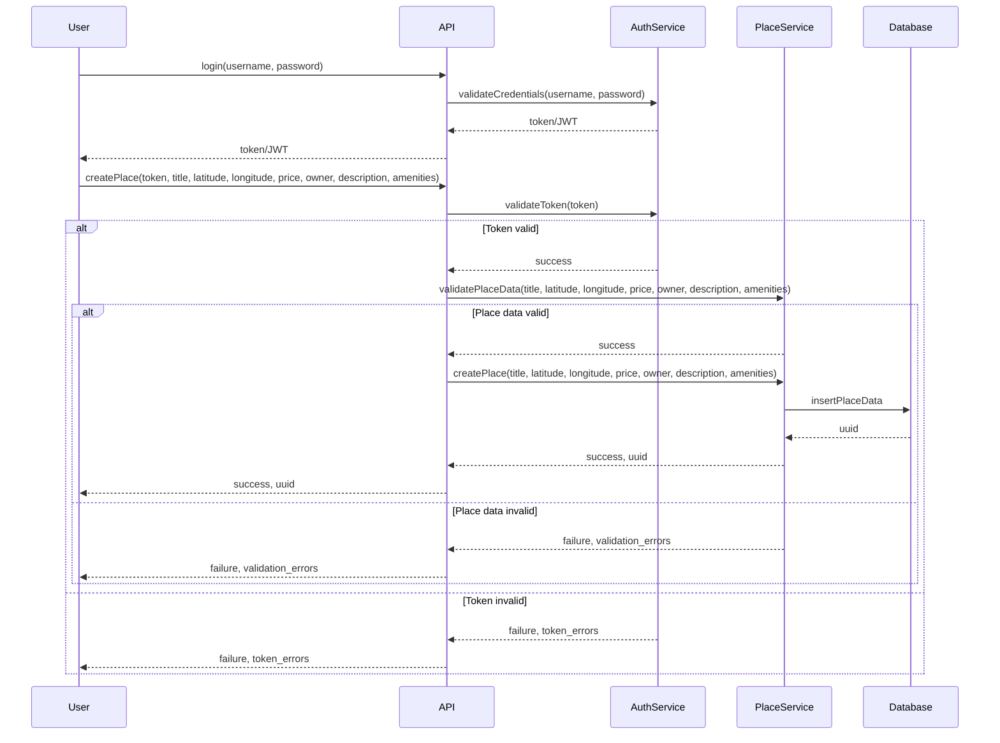
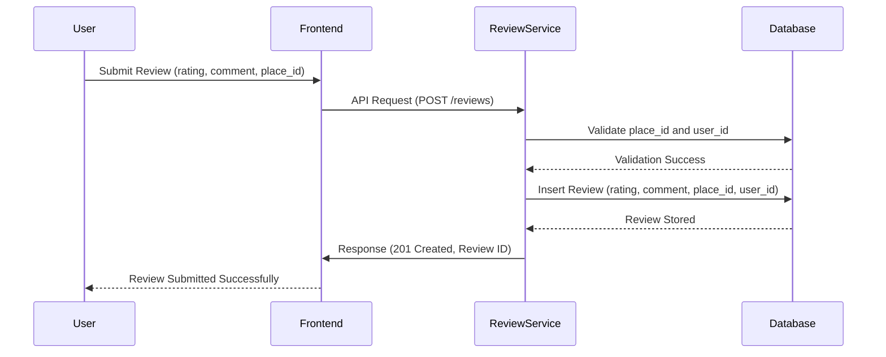

# Documentation Technique du Projet HBnB

## Introduction

Ce document technique décrit l'architecture et le fonctionnement du projet HBnB. Il inclut une vue d'ensemble de l'architecture du projet, une explication détaillée de la couche logique métier et les interactions entre les composants via des diagrammes de séquence des appels API. L'objectif est de fournir une référence claire et structurée pour le développement et la mise en œuvre du projet.

## Architecture de Haut Niveau

Le projet HBnB est organisé en trois couches principales :

- **Presentation Layer (Couche de Présentation)** : Elle fournit les interfaces utilisateur et expose les API.
- **Business Logic Layer (Couche Logique Métier)** : Elle contient les entités principales et la logique métier associée.
- **Persistence Layer (Couche de Persistance)** : Elle gère l'accès et la manipulation des données dans la base de données.

### Diagramme de l'Architecture de Haut Niveau

## Couche Logique Métier

La couche logique métier contient les principales entités utilisées dans le projet HBnB : `User`, `Place`, `Review`, et `Amenity`. Chaque entité a des attributs et méthodes spécifiques qui assurent la gestion des opérations métier.

### Diagramme de Classes de la Couche Logique Métier

## Flux d'Interaction des API

### Enregistrement d'un Utilisateur

### Création d'un Lieu

### Soumission d'un Avis

## Conclusion

Ce document présente une vue complète de l'architecture du projet HBnB, détaillant la structure en couches, la logique métier et les interactions API essentielles. Il servira de guide de référence pour les développeurs travaillant sur l'implémentation du projet.

